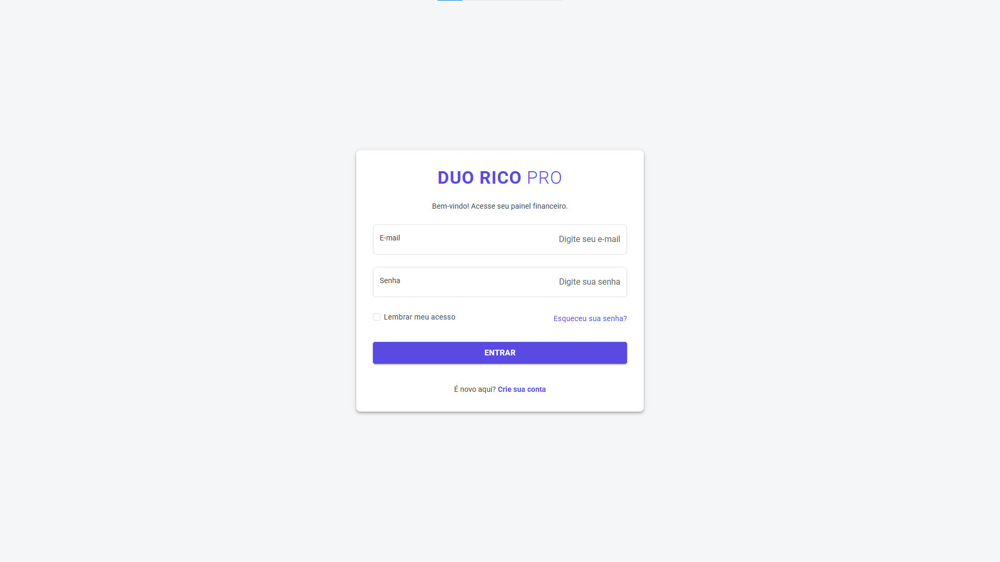
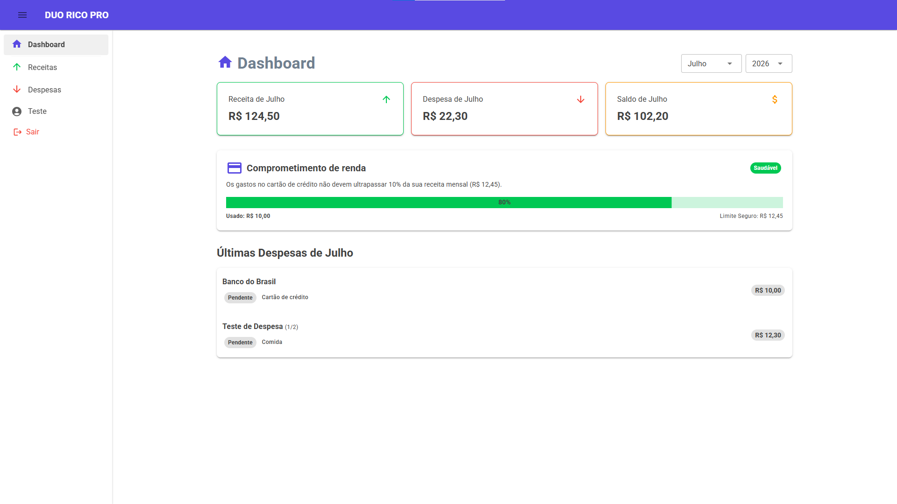
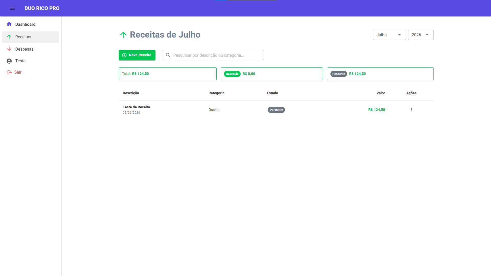
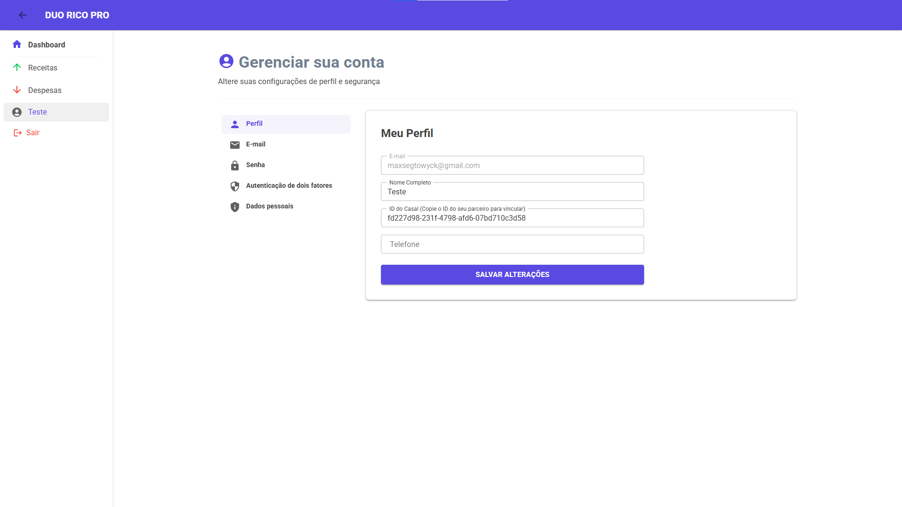
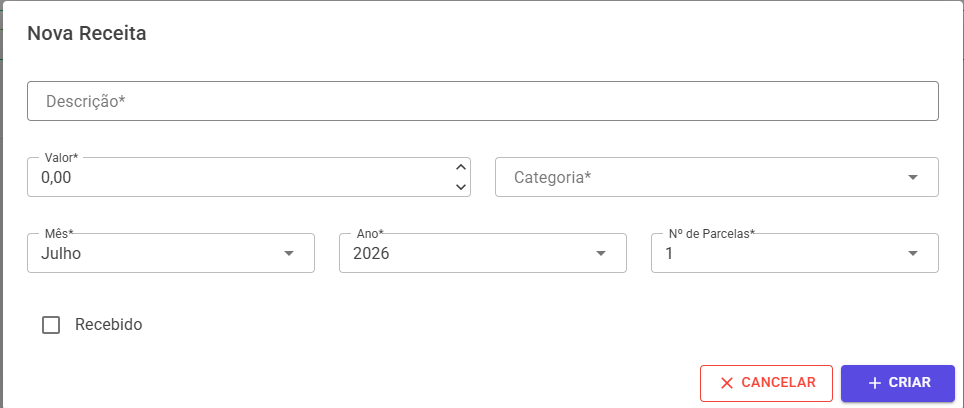
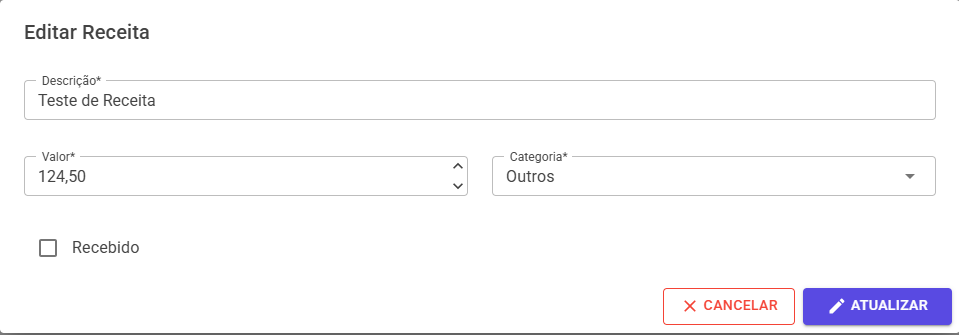

<div align="center">

# 💰 Duo Rico Pro

### Gestão Financeira Inteligente para Casais e Famílias

Aplicação moderna desenvolvida com **Blazor (.NET 10)** para controle de receitas, despesas, parcelamentos e pagamentos, com foco em **segurança**, **performance** e **experiência do usuário**.

<br>


</div>

---

## 📖 Sobre o Projeto

O **Duo Rico Pro** é uma plataforma de gestão financeira desenvolvida para auxiliar casais e famílias no controle financeiro compartilhado.

O projeto foi completamente reconstruído utilizando **Blazor (.NET 10)**, substituindo uma arquitetura anterior baseada em Razor Pages, proporcionando:

- ⚡ Maior performance
- 🎨 Interface moderna baseada em Material Design
- 🔒 Segurança de nível corporativo
- 📱 Experiência otimizada para dispositivos móveis
- ☁️ Infraestrutura preparada para produção

---

# ✨ Funcionalidades

## 👤 Autenticação e Segurança

- Login e Cadastro
- Recuperação de Senha
- Confirmação de E-mail
- Autenticação em Dois Fatores (2FA)
- Aplicativos Autenticadores (Google Authenticator e Microsoft Authenticator)
- Códigos de Recuperação
- ASP.NET Core Identity

---

## 💰 Gestão Financeira

- Cadastro de Receitas e Despesas
- Controle de Parcelamentos
- Status de Pagamento
- Dashboard Financeiro
- Relatórios Resumidos
- Organização por Casal (Couple ID)

---

## 📱 Experiência do Usuário

- Interface Responsiva
- Material Design com MudBlazor
- Layout de Autenticação Personalizado
- Navegação sem Dead Ends
- 
---

# 🏗️ Arquitetura

```text
┌─────────────────────┐
│      Frontend       │
│       Blazor        │
└──────────┬──────────┘
           │
           ▼
┌─────────────────────┐
│ ASP.NET Core (.NET) │
│     Identity        │
│   Entity Framework  │
└──────────┬──────────┘
           │
           ▼
┌─────────────────────┐
│ PostgreSQL (Neon)   │
└─────────────────────┘
```

---

# 🛠️ Stack Tecnológica

| Tecnologia | Utilização |
|------------|------------|
| .NET 10 | Framework Principal |
| Blazor | Interface Web |
| MudBlazor | Componentes UI |
| Entity Framework Core | ORM |
| PostgreSQL | Banco de Dados |
| Neon | Banco Serverless |
| ASP.NET Identity | Autenticação |
| Docker | Containerização |
| Render | Hospedagem |

---

# 🔐 Segurança

A aplicação segue boas práticas para ambientes de produção:

- Autenticação em Dois Fatores (2FA)
- Proteção contra vazamento de credenciais
- Uso de User Secrets em ambiente local
- Senhas criptografadas pelo ASP.NET Identity
- Tokens seguros para redefinição de senha
- Confirmação de e-mail
- Controle de sessões autenticadas

---

# 🚀 Executando Localmente

## Pré-requisitos

- .NET 10 SDK
- PostgreSQL (opcional)
- JetBrains Rider ou Visual Studio ou VS Code

---

## 1️⃣ Clonar o Projeto

```bash
git clone https://github.com/maxmalato/DuoRico.Pro.git

cd DuoRico.Pro
```

---

## 2️⃣ Configurar User Secrets

Dentro da pasta do projeto:

```bash
dotnet user-secrets set "ConnectionStrings:DefaultConnection" "Sua-Connection-String"

dotnet user-secrets set "EmailSettings:Email" "seu-email@provedor.com"

dotnet user-secrets set "EmailSettings:SenhaApp" "sua-senha-de-aplicativo"
```

### Rider

```text
Projeto
 └─ Tools
     └─ .NET User Secrets
```

---

## 3️⃣ Aplicar Migrations

```bash
dotnet ef database update
```

---

## 4️⃣ Executar

```bash
dotnet run
```

Acesse:

```text
https://localhost:5001
```

---

# 🐳 Docker

## Build da Imagem

```bash
docker build -t duorico-pro .
```

## Executar Container

```bash
docker run -p 8080:8080 duorico-pro
```

---

## Dockerfile

```dockerfile
# Build
FROM mcr.microsoft.com/dotnet/sdk:10.0 AS build

WORKDIR /src

COPY ["DuoRico.Pro.csproj", "./"]

RUN dotnet restore "./DuoRico.Pro.csproj"

COPY . .

RUN dotnet publish "DuoRico.Pro.csproj" \
    -c Release \
    -o /app/publish \
    /p:UseAppHost=false

# Runtime
FROM mcr.microsoft.com/dotnet/aspnet:10.0 AS final

WORKDIR /app

EXPOSE 8080

ENV ASPNETCORE_HTTP_PORTS=8080

COPY --from=build /app/publish .

ENTRYPOINT ["dotnet", "DuoRico.Pro.dll"]
```

---

# ☁️ Deploy

O projeto foi preparado para deploy em plataformas modernas de hospedagem:

- Render
- Azure App Service
- Railway
- Fly.io
- VPS Linux com Docker

---

# 📸 Screenshots

<p align="center">
  
  
</p>

<p align="center">
  
  
</p>

<p align="center">
  
  
</p>

---

# 🗺️ Roadmap

- [x] Sistema de Autenticação
- [x] Recuperação de Senha
- [x] 2FA
- [x] Dashboard Financeiro
- [x] Receitas e Despesas
- [ ] Relatórios Avançados
- [ ] Exportação PDF
- [ ] Exportação Excel
- [ ] Aplicativo Mobile

---

# 👨‍💻 Autor

**Maxjannyfer Malato**

Desenvolvedor Full Stack focado em .NET e React.

GitHub:
https://github.com/maxmalato

Portfólio:
https://maxmalato.netlify.app

---

# 📄 Licença

Projeto privado destinado ao gerenciamento financeiro familiar.
